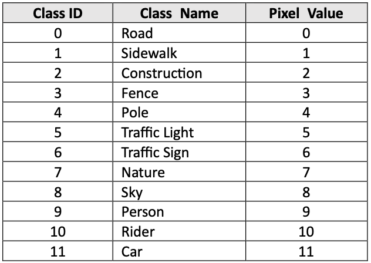

# 2023-Samsung-AI-Challenge-Camera-Invariant-Domain-Adaptation

왜곡이 없는(Rectilinear Source Domain) 이미지와 대응되는 레이블 정보를 활용하여, 
레이블이 존재하지 않는 왜곡된 영상(Fisheye* Target Domain)에서도 강인한 이미지 장면 분할(Semantic Segmentation) 인식을 수행하는 알고리즘 개발  
* Fisheye: 200도의 시야각(200° F.O.V)을 가지는 어안렌즈 카메라로 촬영된 이미지

# Data

├──  train   
│   &nbsp; &nbsp; &nbsp;├── train_source.csv  
│   &nbsp; &nbsp; &nbsp;├── train_source_gt  
│   &nbsp; &nbsp; &nbsp;├── train_source_image   
│   &nbsp; &nbsp; &nbsp;├── train_target.csv  
│   &nbsp; &nbsp; &nbsp;└── train_target_image      
├──  val   
│   &nbsp; &nbsp; &nbsp;├── val_source.csv  
│   &nbsp; &nbsp; &nbsp;├── val_source_gt  
│   &nbsp; &nbsp; &nbsp;└── val_source_image     
└── test  
&nbsp; &nbsp; &nbsp; &nbsp; &nbsp; &nbsp;├── test_image   
&nbsp; &nbsp; &nbsp; &nbsp; &nbsp; &nbsp;└── test_image   

## Sementic Segmentation Class

  

여기에 추가로 배경까지 총 13가지 Class를 가지고 있음.  
test시 효율성을 위해 RLE(Run-Length-Encoding)을 사용.  

ex) '1 3 10 5'는 픽셀 1,2,3 및 10,11,12,13,14가 마스크에 포함되어야 함을 의미